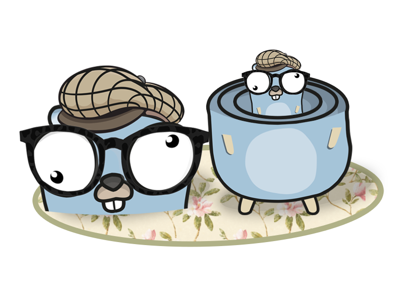

# fiberware

Package fiberware is a collection of fiber middleware

- **Auth** provide an extensible security middleware 

- **Metrics** will use a given Recorder to collect `inflight request`(current parrallel request count)
  , `request duration` and `response size`.

| Name   | Middleware |
| ------ | :--------: |
|**Authentication**|X|
|**Metrics**|X|

## Auth Installation

`go get -u github.com/gol4ng/fiberware/auth`

## Metrics Installation

`go get -u github.com/gol4ng/fiberware/metrics`

## Quick Start

### Server side

```go
package main

import (
	"github.com/gofiber/fiber/v2"
	prom "github.com/gol4ng/fiberware/metrics/prometheus"
	"github.com/gol4ng/fiberware/metrics"
)

func main() {
	app := fiber.New()

	recorder := prom.NewRecorder(prom.Config{}).RegisterOn(nil)
	app.Use(metrics.New(recorder))

	app.Get("/path", func(ctx *fiber.Ctx) error {
		return nil
	})

	go func() {
		if err := app.Listen(":8001"); err != nil {
			panic(err)
		}
	}()
}
```

## Middlewares

A middleware is an `fiber.Handler`, its role is to wrap arround `fiber.Handler` or another middleware
